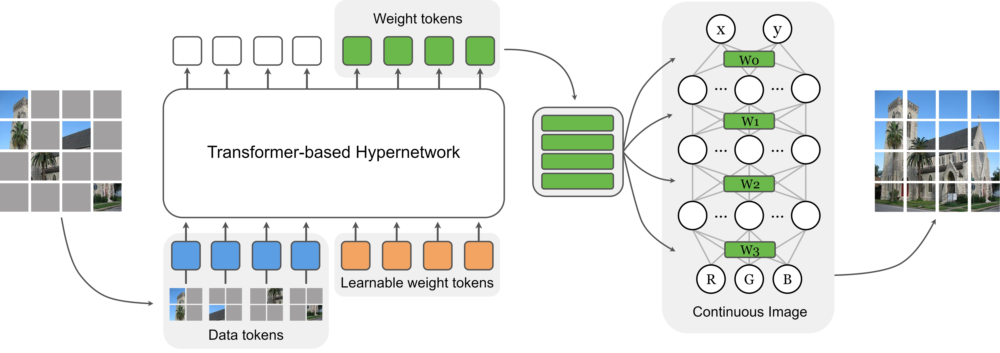

# MINR: Implicit Neural Representations with Masked Image Modelling
*Figure 1: Overall Framework of MINR*
### [Project page](https://heosuab.github.io/MINR/) | [Paper(short)](https://github.com/eccv22-ood-workshop/eccv22-ood-workshop.github.io/blob/new/camera_ready/CameraReady%2045.pdf) | [Poster](https://heosuab.github.io/MINR/static/files/MINR_poster.pdf)
MINR: Implicit Neural Representations with Masked Image Modelling.<br>
Sua Lee, Joonhun Lee, and Myungjoo Kang.<br>
[OOD-CV](https://www.ood-cv.org/) in conjunction with ICCV'23 (ICCV workshop)<br><br>
This repository is highly dependent on [Trans-INR](https://github.com/yinboc/trans-inr) and [Generalized-INR](https://github.com/kakaobrain/ginr-ipc).<br>
MINR simply employed Masked Image Modelling(MIM) with above models, as shown in Figure 1.

## Prerequisites
Our experiments are conducted on following settings
```
python==3.8.16
torch==2.0.1
torchvision==0.15.2
```

## Training
Trans-INR based approach
``` 
python run_trainer.py --cfg {config_file}
```
Generalized-INR based approach
```
sh run_stage_inr.sh \
    -nn=1 \
    -np=1 \
    -nr=0 \
    -r={save_dir} \
    -m={config_file}
```

## Project Structure
This project relies on the following folder organisation:
```
├───trans-MINR                          # folder of trans-INR based approach
|   ├───cfgs                            
│   ├───datasets
│   ├───models
│   ├───trainers
│   ├───utils                                               
│   └───run_trainer.py                  # training code
└───generalized-MINR                    # folder of generalized-MINR
    ├───configs/image               
    └───src
    │   ├───datasets
    │   ├───models
    │   ├───optimizer
    │   ├───trainers
    │   ├───utils
    │   ├───inference.py                # inference codr
    │   └───main_stage_inr.py           # training code
    └───run_stage_inr.sh                # model training script         
                          
```
